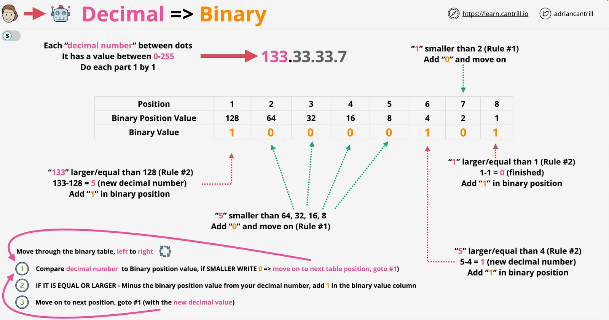

# IPv4 Address

IP addressing, particularly **IPv4 (Internet Protocol version 4)**, is a method used to identify devices on a network. Each device connected to a network (like the internet) is assigned an IP address, which is a unique identifier. Let’s break down the concepts shown in the image.

## Structure of an IPv4 Address

An IPv4 address consists of **32 bits**, and it is split into four parts called octets. Each octet contains 8 bits. The address is typically shown in **dotted-decimal notation** where each octet is represented as a decimal number, separated by dots. For example `133.33.3.7`.

In binary, this address would be:

- `133` → `10000101`
- `33` → `00100001`
- `3` → `00000011`
- `7` → `00000111`

IPv4 addresses consist of two main parts:

- **Network Part**: This identifies the specific network. All devices on the same network share this portion of the IP address.
- **Host Part**: This identifies the individual device within that network.

For example, in the IP address `133.33.3.7` with a `/16` prefix, the `133.33` part represents the network, and `3.7` represents the host within that network.

## Decimal to Binary Conversion

  

## Subnetting and Subnet Masks

**Subnetting** is a process of dividing a larger network into smaller sub-networks (subnets), making it easier to manage and improving network efficiency and security.

A **subnet mask** is a 32-bit number used to separate the network part of the IP address from the host part. It is usually written in the same dotted-decimal format as an IP address, such as `255.255.0.0`.

### Binary Representation:

A subnet mask consists of a series of 1s followed by a series of 0s. The 1s indicate the network portion and the 0s indicate the host portion.

For example, the subnet mask `255.255.0.0` in binary is `11111111.11111111.00000000.00000000`.

### CIDR Notation:

The subnet mask can also be represented in **CIDR (Classless Inter-Domain Routing)** notation. For example, `/16` indicates that the first 16 bits are used for the network portion (`255.255.0.0`).

### Network Calculation:

- **Starting Address (Network ID)**: The first address in a network is calculated by setting all host bits to 0. For instance, in the network `133.33.3.7/16`, the network start address is `133.33.0.0`.
- **Ending Address (Broadcast Address)**: The last address in the network is calculated by setting all host bits to 1. In the same example, the broadcast address is `133.33.255.255`.

### Role of Subnet Masks:

- **Local Communication**: If two devices share the same network part of their IP addresses, they can communicate directly without needing to go through a router.
- **Remote Communication**: If the destination IP is on a different network, the packet is sent to a router (gateway) for forwarding to the correct network.

## Routing and Route Tables

**Routing** is the process by which packets are forwarded from one network to another to reach their destination.

### Routing Table:

Routers use a **routing table** to determine the best path to send packets to their destination. The routing table contains:

- **Destination**: The network or IP address that the packet is destined for.
- **Next Hop**: The IP address of the next router or gateway.
- **Interface**: The router’s interface through which the packet should be sent.

### Example of Routing:

Consider a packet from IP `1.3.3.7` destined for `52.217.13.37`:

1. The packet is first sent to the local router.
2. The router checks its routing table to find the best match for the destination network (`52.217.13.0/24`).
3. The packet is then forwarded to the next hop, eventually reaching its destination through multiple routers if necessary.

## IP Routing (Network Layer)

**IP routing** occurs at the Network Layer of the OSI model and involves moving packets across different networks until they reach their final destination.

### Step-by-Step Routing Process:

1. **Identify Non-Local Destination**: The sending device uses the subnet mask to determine if the destination IP is within the local network. If it is not, the packet is sent to the router.
2. **ARP to Find Gateway MAC**: The Address Resolution Protocol (ARP) is used to map the IP address of the router (gateway) to its MAC address.
3. **Send Data to Router**: The packet is encapsulated in a frame with the router’s MAC address and sent to the router.
4. **Router Processing**: The router removes the Layer 2 encapsulation, checks the destination IP, and forwards the packet to the next hop based on its routing table.
5. **Route to Final Destination**: The process continues with the packet being forwarded from router to router until it reaches the destination network, where the final router sends it to the destination device.

# IPv6 

**IPv6 (Internet Protocol version 6)** is the most recent version of the Internet Protocol (IP), which is used to identify and locate devices on a network and route traffic across the internet. IPv6 was developed to address the limitations of IPv4, particularly the exhaustion of available IP addresses.

## Key Features of IPv6:

### Larger Address Space:

IPv6 uses **128-bit addresses**, which allows for a vastly larger number of IP addresses than IPv4's 32-bit system. Specifically, IPv6 can support approximately `3.4×10^{38}` (340 undecillion) unique addresses, compared to IPv4's 4.3 billion.

IPv6 addresses are written in hexadecimal and separated by colons, for example: `2001:0db8:85a3:0000:0000:8a2e:0370:7334`.

### Address Format:

An IPv6 address consists of **eight groups** of four hexadecimal digits. For simplicity, leading zeros in any group can be omitted, and consecutive sections of zeros can be replaced with `::` (but this can only be used once in an address).

Example: `2001:0db8:0000:0042:0000:8a2e:0370:7334` can be shortened to `2001:db8:0:42::8a2e:370:7334`.

### No Need for NAT (Network Address Translation):

Due to the abundant address space, IPv6 eliminates the need for NAT, which is commonly used in IPv4 to extend the limited number of IP addresses by allowing multiple devices on a private network to share a single public IP address.

### Simplified Header:

IPv6 has a simplified packet header compared to IPv4, which improves routing efficiency. The IPv6 header is fixed at **40 bytes** in size, regardless of the size of any optional extension headers.

### Built-In Security:

IPv6 was designed with security in mind, and **IPsec (Internet Protocol Security)** is a mandatory part of the protocol, whereas it was optional in IPv4.

### Autoconfiguration:

IPv6 supports **stateless address autoconfiguration (SLAAC)**, allowing devices to automatically configure themselves with an IPv6 address without needing a DHCP server.

### Improved Multicast and Anycast:

IPv6 introduces better support for **multicast** (sending a packet to multiple destinations) and **anycast** (sending a packet to the nearest of multiple destinations) addressing.

### Lack of Broadcast:

Unlike IPv4, IPv6 does not support broadcasting (sending a packet to all devices on a network). Instead, it uses multicast for similar purposes, reducing unnecessary network traffic.

## Transition from IPv4 to IPv6:

The transition from IPv4 to IPv6 has been gradual because IPv4 is still widely used. To facilitate this, several techniques have been developed, such as **dual-stack** (where devices run both IPv4 and IPv6), **tunneling** (where IPv6 packets are encapsulated within IPv4 packets), and **translation methods** that allow communication between IPv4 and IPv6 devices.

## Example of an IPv6 Address:

Here's an example of an IPv6 address and its breakdown:

`2001:0db8:85a3:0000:0000:8a2e:0370:7334`

- `2001:0db8`: The first 48 bits are typically the network prefix, identifying the network segment.
- `85a3`: The next 16 bits might be used to identify a subnet within the network.
- `0000:0000:8a2e:0370:7334`: The last 64 bits are used to identify the interface or device on the network, often referred to as the interface identifier.
