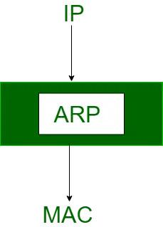

# Address Resolution Protocol (ARP)

ARP (Address Resolution Protocol) is a networking protocol that translates logical IP addresses into physical MAC addresses, which are necessary for communication on a local network. While most computer programs and applications use IP addresses for sending and receiving messages, the actual communication at the network layer happens using MAC addresses. ARP's primary function is to map the IP addresses to their corresponding MAC addresses, enabling devices to communicate with each other on the same local network.

  

## Step-by-Step Explanation

### 1. Sending Data

A computer (let's call it Computer A) wants to send data to another computer (Computer B) within the same local network. Computer A knows the IP address of Computer B (133.33.3.10) but doesn’t know its MAC address.

### 2. Network Layer (L3) Handling

The data is prepared at the Network Layer, where the source IP (133.33.3.7) and destination IP (133.33.3.10) are added to the packet.

### 3. Data Link Layer Broadcast

To find out the MAC address associated with the IP 133.33.3.10, Computer A broadcasts a message to all devices in the local network asking, "Who has 133.33.3.10?"  
This is done at the Data Link Layer using a special frame that is broadcast to all devices in the local network.

### 4. Reply from the Target

Computer B responds to the broadcast by saying, "I am 133.33.3.10," along with its MAC address (3e:22:fb:b9:5b:78).

### 5. Data Transmission

Computer A now knows Computer B's MAC address. It creates a frame at the Data Link Layer with Computer B's MAC address as the destination and sends the data.

This data passes through the layers:

- **Physical Layer (L1):** Responsible for transmitting raw bits over a physical medium.
- **Data Link Layer (L2):** Where the MAC addresses are used for addressing devices in the local network.

Finally, the data reaches Computer B. Computer B receives the data, and the packet is handed to the application.
